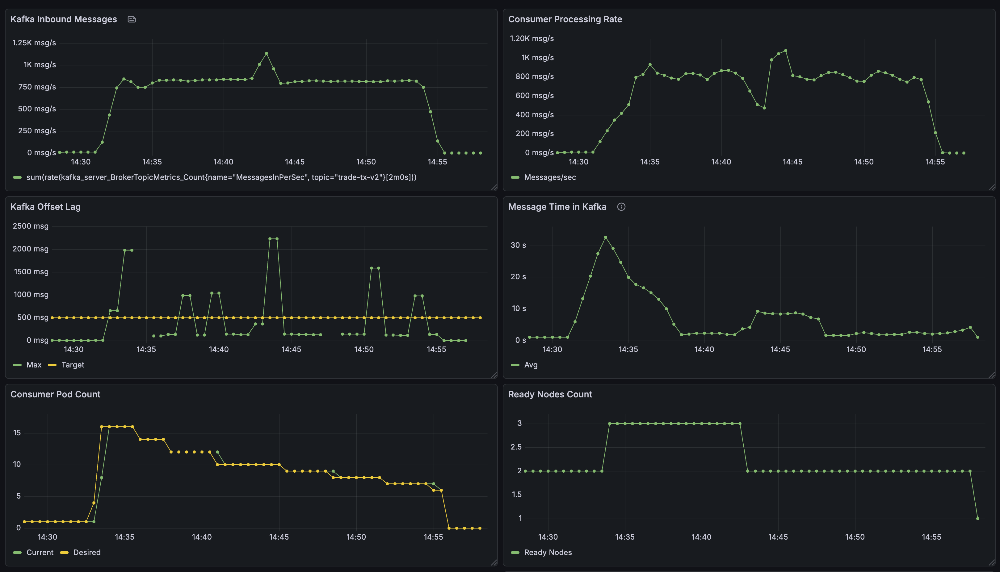

# MSK EKS Demo - Event-Driven Financial Transaction Processing

## Introduction

This architecture demonstrates how to process variable financial transaction volumes with speed and cost efficiency. Financial workloads experience dramatic volume fluctuations driven by market events, settlement windows, and cross-border activity—requiring infrastructure that scales elastically while maintaining strict ordering guarantees, audit compliance, and multi-tenant isolation.

The solution combines **AWS MSK** (managed Kafka) for durable message streaming with **Amazon EKS** and **KEDA** for event-driven autoscaling. It delivers:

- **Massive parallelization** across Kafka partitions for high throughput
- **Sub-minute scaling** from 0 to 20+ consumer pods based on real-time lag
- **Message persistence and replay** for audit/compliance requirements
- **Ordering guarantees** via Kafka partition keys when needed
- **Multi-tenant isolation** for service providers managing multiple institutions
- **Managed services** (MSK, EKS) to reduce operational overhead
- **Built-in security** with IAM authentication and encryption

## Architecture Components


- **AWS MSK**: Managed Kafka cluster with IAM authentication and 24 partitions for parallelization
- **Amazon EKS**: Kubernetes cluster with automatic compute management
- **KEDA**: Event-driven autoscaler monitoring Kafka consumer lag (scales 0-20 replicas)
- **Consumer Application**: Microbatch processor with cooperative rebalancing for zero-downtime scaling
- **Producer Simulator**: Generates variable transaction loads to demonstrate elasticity
- **Prometheus + Grafana**: Observability stack for metrics and dashboards

## Prerequisites

- AWS CLI configured with appropriate credentials
- Docker installed and running
- Terraform >= 1.3
- kubectl
- jq

## Deployment Steps

### Step 1: Deploy Infrastructure

Deploy the underlying infrastructure using Terraform:

```bash
./deploy-infra.sh
```

This creates:
- **VPC** with public/private subnets across 3 AZs
- **MSK cluster** with 3 brokers, 24 partitions, IAM authentication
- **EKS cluster** with Auto Mode for managed compute
- **IAM roles and policies** for Pod Identity (producer, consumer, KEDA)
- **Prometheus + Grafana** for observability (in cluster kube-prometheus-stack)
- **KEDA operator** for event-driven autoscaling

**Verify MSK bootstrap servers were added to .env:**
```bash
grep "KAFKA_BOOTSTRAP_SERVERS" .env
```

### Step 2: Deploy Consumer Application

```bash
./deploy-consumer.sh
```

This deploys:
- **Consumer Deployment**: Kubernetes deployment running the transaction processor
  - Registers as consumer group `trade-tx-consumer` with MSK
  - Polls messages from topic `trade-tx-v2`
  - Uses **microbatching** to aggregate records (configurable `BATCH_SIZE`) before processing
  - Simulates batch DB writes with configurable `BATCH_PROCESSING_TIME`
  - Implements **cooperative rebalancing** to minimize processing interruption during scale events

- **KEDA ScaledObject**: Configures autoscaling behavior
  - Monitors `OffsetLag` metric (pending messages per partition)
  - Scales from **0 to 20 replicas** based on lag threshold of 500 messages
  - When lag > 500: KEDA scales up pods to meet demand
  - When lag < 500: KEDA scales down to save resources
  - When lag = 0: KEDA scales to zero after cooldown period

**Microbatching benefits**: Aggregating multiple records into a single DB operation significantly reduces write latency—the typical bottleneck in transaction processing.

### Step 3: Deploy Producer (Low Load)

Deploy the producer with initial low load:

```bash
./deploy-producer.sh 10
```

This creates a Kubernetes deployment generating simulated trade transactions at **~10 messages/second**. In production, this would be replaced by an ingress layer managing client connections.

**Check producer logs:**
```bash
kubectl logs -l app=trade-tx-producer
```

Expected output:
```
[2025-12-04 19:27:10] INFO: Starting continuous producer: 10 messages/second
[2025-12-04 19:27:20] INFO: Sent trades count: 100 - Last: SELL 15 AAPL for ACC2015
[2025-12-04 19:27:31] INFO: Sent trades count: 200 - Last: SELL 766 NVDA for ACC9985
```

**Check consumer logs:**
```bash
kubectl logs -l app=trade-tx-consumer
```

Expected output:
```
[2025-12-04 19:27:49] INFO: Processing message from partition 11, offset 1795619
[2025-12-04 19:27:49] INFO: Processing message from partition 2, offset 1608403
[2025-12-04 19:27:49] INFO: Processing message from partition 18, offset 1649736
```

**Monitor autoscaling:**
```bash
kubectl get hpa
```

At 10 msg/s, lag stays below the 500-message threshold, so only **1 replica** runs:
```
NAME                                REFERENCE                      TARGETS      MINPODS   MAXPODS   REPLICAS
keda-hpa-trade-tx-consumer-scaler   Deployment/trade-tx-consumer   13/500       1         20        1
```

### Step 4: Simulate Demand Spike

Increase load to simulate a market event:

```bash
./deploy-producer.sh 1000
```

This increases message generation to **~1000 messages/second** (100x spike).

**Watch HPA scale out:**
```bash
watch kubectl get hpa
```

HPA scales to meet demand:
```
NAME                                REFERENCE                      TARGETS        MINPODS   MAXPODS   REPLICAS
keda-hpa-trade-tx-consumer-scaler   Deployment/trade-tx-consumer   2000/500       1         20        16
```

HPA continuously recalculates replicas using:
```
desired_replicas = (current_metric / target_metric) × current_replicas
```

As consumers process the backlog, HPA gradually scales down to match actual demand:
```
NAME                                REFERENCE                      TARGETS      MINPODS   MAXPODS   REPLICAS
keda-hpa-trade-tx-consumer-scaler   Deployment/trade-tx-consumer   298/500      1         20        10
```

**Cooperative Rebalancing**: During scale events, Kafka redistributes partition assignments across pods. With default "eager" rebalancing, all consumers pause for 30-60 seconds—violating SLAs during critical moments. This demo uses **cooperative rebalancing**, allowing most pods to continue processing while only affected pods pause briefly, ensuring consistent throughput during scaling.

### Step 5: Scale to Zero

Stop the producer to simulate zero load:

```bash
kubectl delete deployment -n default trade-tx-producer
```

Once the consumer processes all remaining messages and lag reaches zero, KEDA waits for the cooldown period, then:
1. Deletes the HPA
2. Scales the deployment to **0 replicas**

This eliminates compute costs during idle periods while maintaining instant readiness to scale back up when new messages arrive.

## Monitoring

**Access Grafana dashboard:**
```bash
kubectl port-forward -n kube-system svc/kube-prometheus-stack-grafana 3000:80
```
Open http://localhost:3000 (default credentials: admin/prom-operator)

**Access provided dashboard:**
Title: "MSK & KEDA Monitoring"



## Configuration

Edit `.env` files in application directories:

**Producer (`trade-tx-producer/.env`):**
- `MESSAGES_PER_SECOND`: Message generation rate

**Consumer (`trade-tx-consumer/.env`):**
- `BATCH_SIZE`: Messages per microbatch (default: 100)
- `BATCH_PROCESSING_TIME`: Simulated DB write time in seconds (default: 5)

## Clean Up

```bash
cd infra-tf
terraform destroy
```

## Project Structure

```
.
├── deploy-infra.sh           # Deploy infrastructure
├── deploy-producer.sh        # Deploy producer
├── deploy-consumer.sh        # Deploy consumer
├── infra-tf/                 # Terraform configuration
├── trade-tx-producer/        # Producer application
└── trade-tx-consumer/        # Consumer application
```
